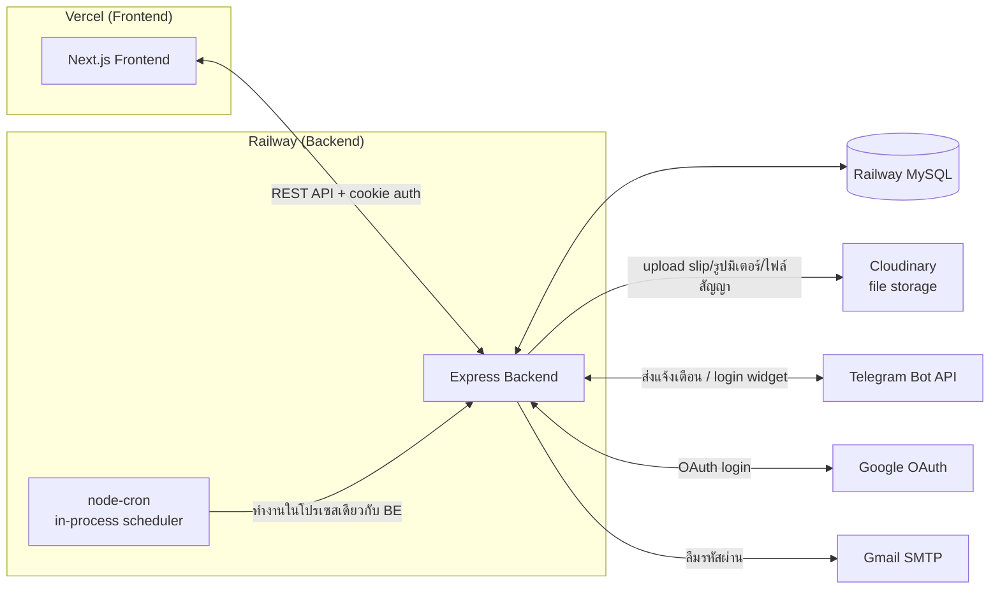
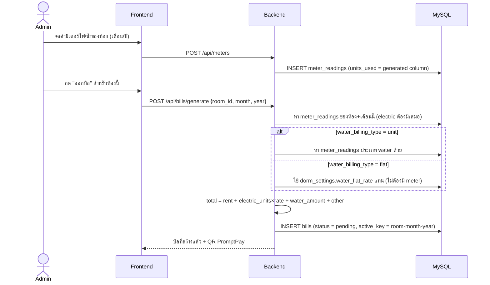
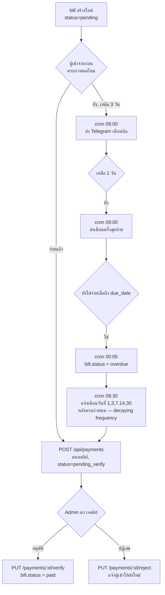
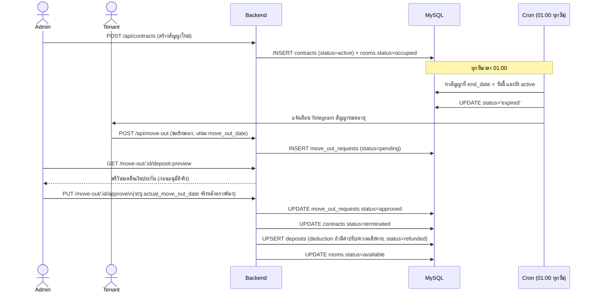
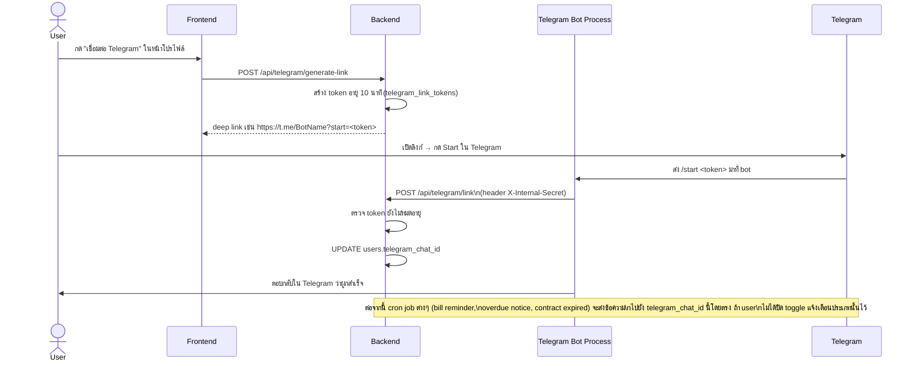

# SDMS Architecture & Flow Diagrams

Diagram ทั้งหมดเป็น [Mermaid](https://mermaid.js.org/) — GitHub render ให้อัตโนมัติเวลาเปิดไฟล์นี้บนเว็บ

## System Overview

---

## Flow 1: การสร้างและออกบิล (Bill Generation)

**จุดสำคัญ:** ออกบิลไม่ได้ถ้ายังไม่ได้จดมิเตอร์ไฟของเดือนนั้น (throw error) — ต้องจดมิเตอร์ก่อนออกบิลเสมอ ยกเว้นค่าน้ำที่เลือกโหมด `flat` ได้ไม่ต้องมี meter reading

---

## Flow 2: วงจรบิลจนถึงจ่ายเงิน (รวม cron job)

**จุดสำคัญ:** บิล `paid` ไม่ได้ set อัตโนมัติแค่เพราะมีคนอัปโหลดสลิป — ต้องรอแอดมิน verify ก่อนเสมอ (กันสลิปปลอม/จ่ายผิดยอด) และการแจ้งเตือนค้างชำระใช้ **decaying frequency** (แจ้งเฉพาะวันที่ 1/3/7/14/30 หลังครบกำหนด) แทนการยิงทุกวัน เพื่อลด alert fatigue ของผู้เช่า

---

## Flow 3: สัญญาเช่า → ย้ายออก → คืนเงินประกัน

**จุดสำคัญ:** คำนวณเงินคืนประกันใช้ `actual_move_out_date` (วันที่แอดมินยืนยันหลังตรวจสภาพห้องจริง) เสมอ **ไม่ใช่** `move_out_date` ที่ผู้เช่าเสนอมาตอนแรก เพราะสองค่านี้อาจไม่ตรงกัน (เช่น ผู้เช่าขอย้าย 1 ธ.ค. แต่จริงๆย้ายออกจริง 5 ธ.ค.)

---

## Flow 4: Telegram Notification & Account Linking

**จุดสำคัญด้านความปลอดภัย:** endpoint `POST /api/telegram/link` **ไม่ได้ใช้ JWT cookie ของ user** เพราะถูกเรียกจาก bot process (server-to-server) ไม่ใช่ browser — ป้องกันด้วย shared secret (`BOT_INTERNAL_SECRET`) ผ่าน header `X-Internal-Secret` แทน ถ้า secret รั่วจะสามารถผูก telegram chat id เข้ากับ user คนไหนก็ได้ ต้องเก็บ secret นี้ให้ปลอดภัยเหมือน `JWT_SECRET`

---

## เอกสารที่เกี่ยวข้อง

- API endpoints ทั้งหมด → [`backend/docs/API.md`](../backend/docs/API.md)
- โครงสร้างตาราง/ERD → [`database/DATABASE.md`](../database/DATABASE.md)
- วิธี deploy → [`docs/DEPLOYMENT.md`](./DEPLOYMENT.md)